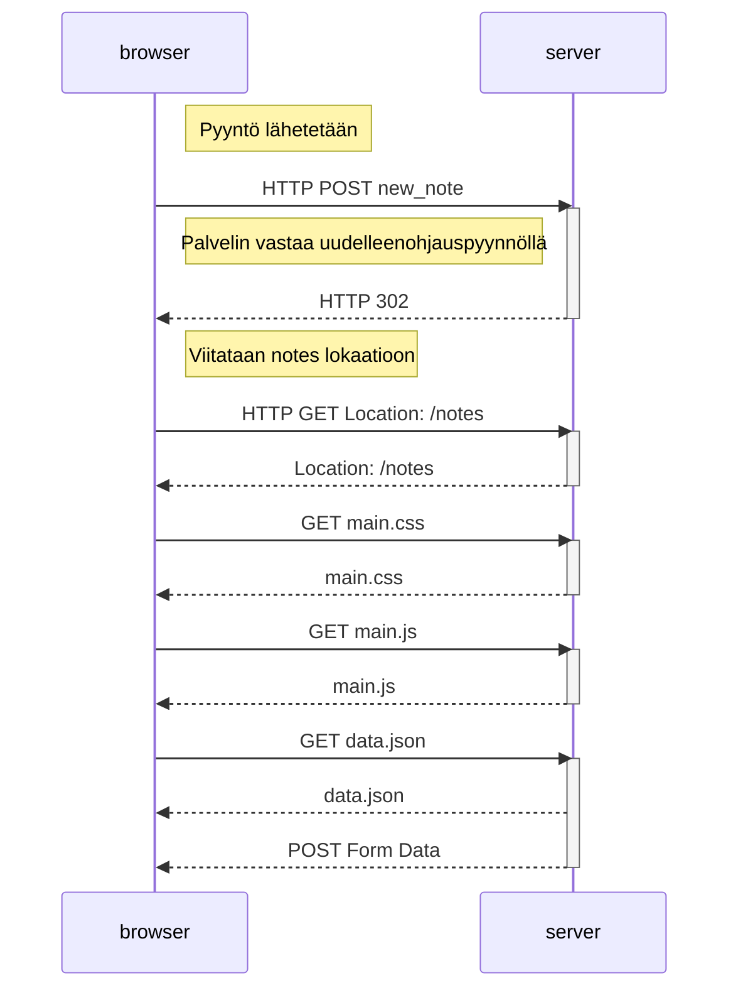

```mermaid
sequenceDiagram
    participant browser
    participant server
   
    Note right of browser: Pyyntö lähetetään
    browser->>server: HTTP POST new_note
  
    
    activate server
    
    Note right of browser: Palvelin vastaa uudelleenohjauspyynnöllä
    server-->>browser: HTTP 302
    deactivate server
    Note right of browser: Viitataan notes lokaatioon
    browser->>server: HTTP GET Location: /notes
    activate server
    server-->>browser: Location: /notes
    deactivate server
    browser->>server: GET main.css
    activate server
    server-->>browser: main.css
    deactivate server
    browser->>server: GET main.js
    activate server
    server-->>browser: main.js
    deactivate server
    browser->>server: GET data.json
    activate server
    server-->>browser: data.json
    server-->>browser: POST Form Data
    deactivate server     

```